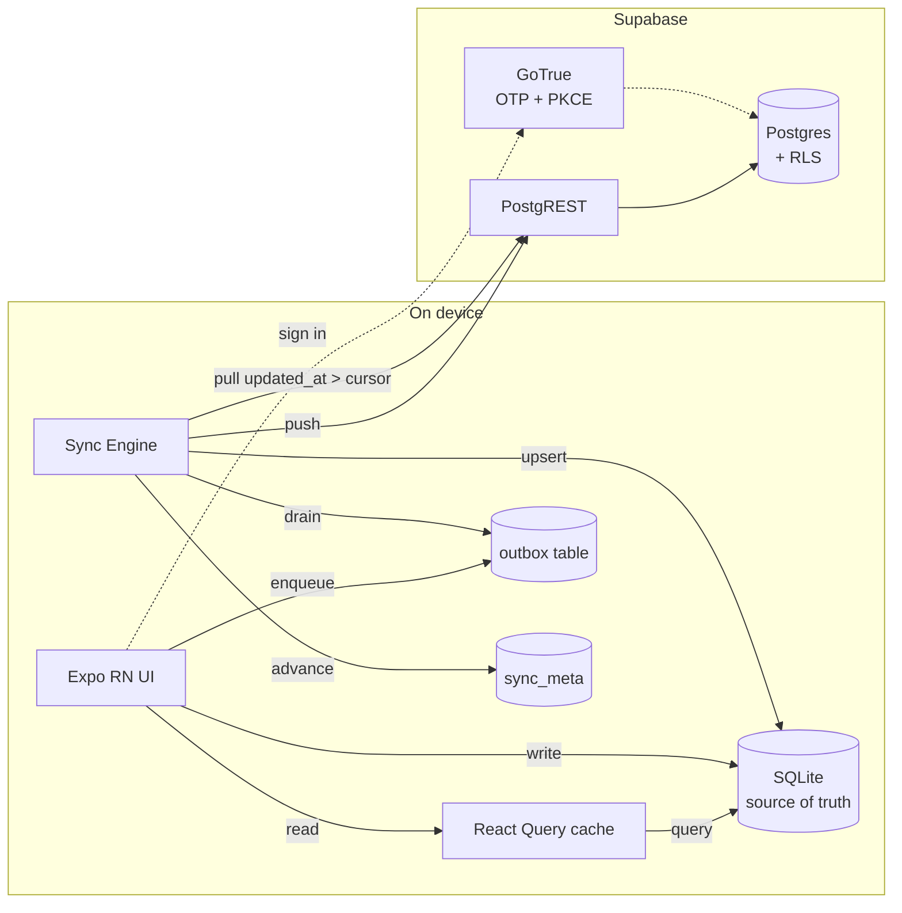
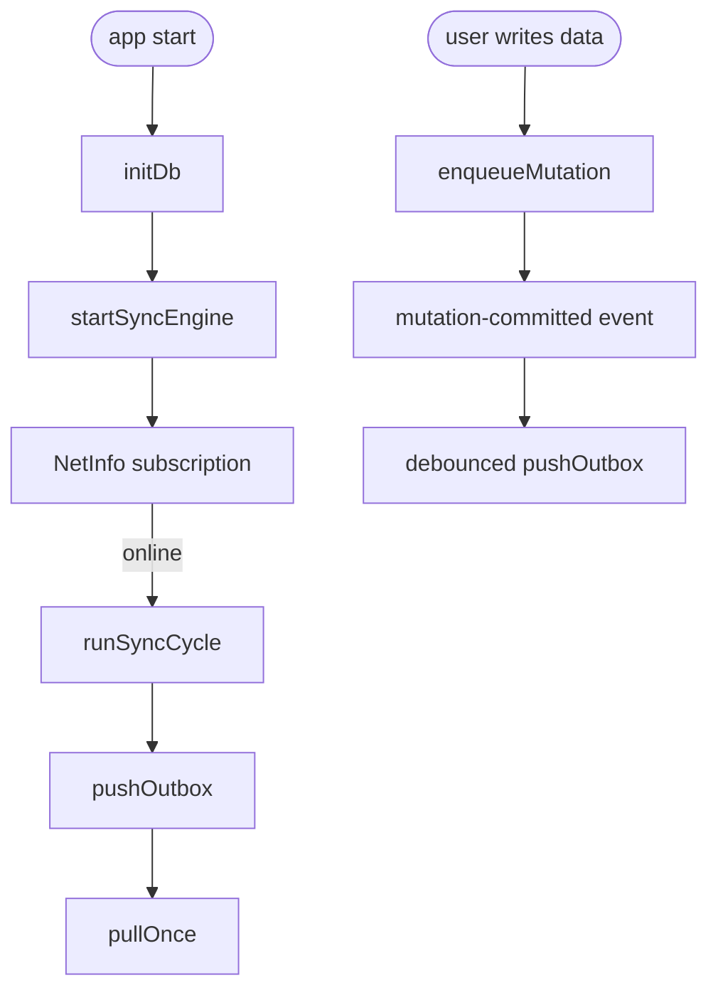
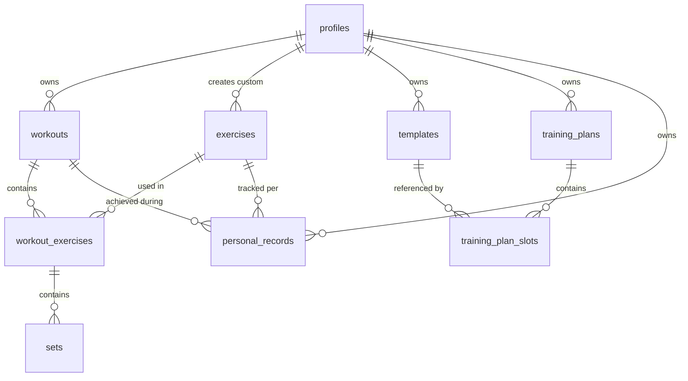
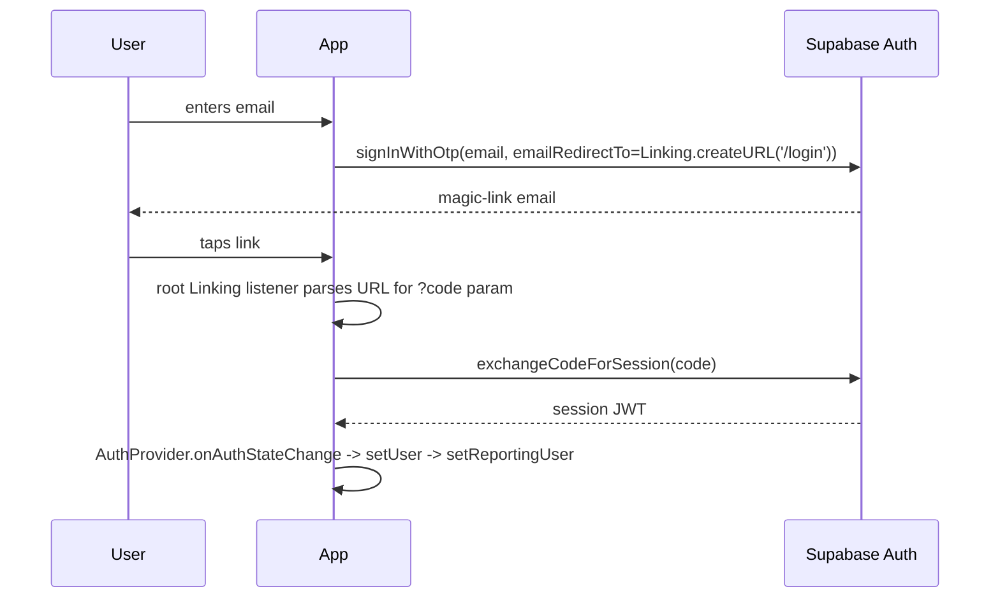

# Architecture

FlexYug (developed in the `vyayamy` repo) is a mobile-only, **local-first** strength-training journal. The client owns the data during a session: every user action commits to SQLite synchronously, and the sync engine propagates those writes to Supabase in the background. The network is never in the critical path of logging a set.

---

## Table of Contents

1. [System Overview](#system-overview)
2. [High-Level Architecture](#high-level-architecture)
3. [Provider Tree and Navigation](#provider-tree-and-navigation)
4. [Data Layer](#data-layer)
5. [Sync Engine](#sync-engine)
6. [Database Design](#database-design)
7. [Authentication](#authentication)
8. [Personal Record Detection](#personal-record-detection)
9. [Rest Timer and Notifications](#rest-timer-and-notifications)
10. [Error Reporting](#error-reporting)
11. [Design System](#design-system)
12. [Native Health Boundary](#native-health-boundary)
13. [Security Model](#security-model)
14. [Key Design Decisions](#key-design-decisions)

---

## System Overview

The app runs entirely on the user's phone. SQLite, not Supabase, is the source of truth during a session. Supabase is a durable mirror reached only by the sync engine.



Key properties:

- No custom API server
- Writes never block on the network
- Last-write-wins is sufficient: single user, often single device
- Every mutable table carries `updated_at` and `deleted_at`; hard deletes are never issued

---

## High-Level Architecture

| Concern              | Solution                                                                                                                          |
| -------------------- | --------------------------------------------------------------------------------------------------------------------------------- |
| UI rendering         | React Native (Expo SDK 56), React 19 functional components                                                                        |
| Navigation           | Expo Router (file-based under [app/](app/), typed routes)                                                                         |
| Local state          | `useState` / `useReducer` inside components                                                                                       |
| Server state         | TanStack React Query 5, backed by SQLite reads                                                                                    |
| Local persistence    | `expo-sqlite` ([src/db/](src/db/))                                                                                                |
| Sync                 | In-house outbox + incremental pull ([src/sync/](src/sync/))                                                                       |
| Auth                 | Supabase GoTrue, OTP + PKCE, `expo-linking` deep link exchange                                                                    |
| Remote persistence   | Supabase Postgres + PostgREST, reached only by the sync engine                                                                    |
| Authorization        | Row Level Security in Postgres                                                                                                    |
| Styling              | `useTheme()` + `makeStyles(theme)`; tokens in [src/ui/colors.ts](src/ui/colors.ts) / [src/ui/typography.ts](src/ui/typography.ts) |
| Charts               | `react-native-svg` via [src/ui/LineChart.tsx](src/ui/LineChart.tsx)                                                               |
| Haptics              | `expo-haptics`                                                                                                                    |
| Timers               | `setInterval` foreground, `expo-notifications` for background rest cue                                                            |
| Error reporting      | `@sentry/react-native` gated by DSN                                                                                               |
| Testing              | Jest + `ts-jest`, `better-sqlite3` in-memory mock of `expo-sqlite`                                                                |
| Build / distribution | EAS Build, EAS Submit                                                                                                             |

There is no server-side rendering, no ORM, no middleware, and no custom HTTP layer. UI code does not call `supabase.from()` directly; only the sync engine does.

---

## Provider Tree and Navigation

### Provider Tree

Defined in [app/\_layout.tsx](app/_layout.tsx). Order matters:

```
ErrorBoundary
  └─ GestureHandlerRootView
       └─ SafeAreaProvider
            └─ SkinProvider (skin tokens + hydration gate)
                 └─ QueryClientProvider       ← TanStack Query cache
                      └─ AuthProvider          ← Supabase session + user
                           └─ ToastProvider    ← transient notifications
                                └─ AppNavigator (Stack) + BootOverlay
```

`RootLayout` also initializes the local database (`initDb()`) and starts the sync engine (`startSyncEngine(queryClient)`) once. Sentry init runs at module load via `initErrorReporting()` and is a no-op if no DSN is configured.

### Navigation

Expo Router maps the filesystem under [app/](app/) to routes:

| Route                 | File                                                     | Notes                       |
| --------------------- | -------------------------------------------------------- | --------------------------- |
| `/(tabs)/today`       | [app/(tabs)/today.tsx](<app/(tabs)/today.tsx>)           | Dashboard                   |
| `/history`            | [app/history/index.tsx](app/history/index.tsx)           | Past workouts (stack route) |
| `/(tabs)/progress`    | [app/(tabs)/progress.tsx](<app/(tabs)/progress.tsx>)     | PRs + charts                |
| `/(tabs)/profile`     | [app/(tabs)/profile.tsx](<app/(tabs)/profile.tsx>)       | Settings                    |
| `/workout/active`     | [app/workout/active.tsx](app/workout/active.tsx)         | Live session                |
| `/history/[id]`       | [app/history/[id].tsx](app/history/[id].tsx)             | Dynamic detail route        |
| `/profile/plan`       | [app/profile/plan/index.tsx](app/profile/plan/index.tsx) | Training plan               |
| `/profile/plan/setup` | [app/profile/plan/setup.tsx](app/profile/plan/setup.tsx) | Plan setup wizard           |
| `/login`              | [app/login.tsx](app/login.tsx)                           | OTP sign-in                 |
| `*`                   | [app/+not-found.tsx](app/+not-found.tsx)                 | Catch-all                   |

Route files are thin; the real screens live in [src/screens/](src/screens/) and are imported by the route file. This keeps routing declarative and lets screens stay portable across navigation choices.

A single root-level auth gate in `AppNavigator` ([app/\_layout.tsx](app/_layout.tsx)) redirects every route except `/login` to `/login` until a session exists, so sibling stack routes cannot be reached by deep link without authentication.

---

## Data Layer

### Write path

Every user action that touches data calls `enqueueMutation()` in [src/db/mutations.ts](src/db/mutations.ts). Both the local write and the outbox row happen in a single SQLite transaction:

```ts
await db.withTransactionAsync(async () => {
  // 1. Apply the change to the local table (insert/upsert/update/soft-delete)
  // 2. Append one row to the outbox describing the server-side effect
});
```

There is no optimistic/rollback branching in UI code. By the time the function returns, the write is durable locally. The sync engine picks up the outbox asynchronously.

### Read path

Screens consume React Query hooks in [src/queries/](src/queries/). Each hook's `queryFn` reads SQLite via `getDb()` instead of hitting the network:

```ts
return useQuery({
  queryKey: [...WORKOUTS_KEY, 'recent', userId ?? ''],
  queryFn: async () => {
    const db = await getDb();
    return db.getAllAsync<Workout>(
      `SELECT * FROM workouts
         WHERE user_id = ? AND deleted_at IS NULL
         ORDER BY started_at DESC LIMIT 20`,
      [userId],
    );
  },
  enabled: !!userId,
});
```

React Query still earns its keep: cache, dedup, and hook ergonomics across the screen tree. All reads filter `deleted_at IS NULL`; tombstones are visible only to the sync engine.

### Mutations

Mutations go through `enqueueMutation` and never call `supabase.from()` directly. That boundary is now genuinely enforced: a `no-restricted-imports` rule forbids importing [src/auth/supabase.ts](src/auth/supabase.ts) anywhere except [src/sync/](src/sync/) and [src/auth/](src/auth/); everything else uses the auth facade [src/auth/authActions.ts](src/auth/authActions.ts). Pushing is structural too: a write emits a mutation-committed event ([src/db/mutationEvents.ts](src/db/mutationEvents.ts)) and the engine debounces a push. The queries layer no longer imports the sync engine.

---

## Sync Engine

The engine ([src/sync/engine.ts](src/sync/engine.ts)) owns lifecycle:

- Subscribes to `@react-native-community/netinfo` for connectivity
- Triggers a sync cycle on startup, network regain, app foreground, and auth change; committed mutations trigger a debounced push via the mutation event bus
- Coalesces concurrent push/pull runs with in-flight flags
- Publishes state via a lightweight pub/sub in [src/sync/state.ts](src/sync/state.ts) consumed by [src/ui/SyncIndicator.tsx](src/ui/SyncIndicator.tsx)



### Push ([src/sync/push.ts](src/sync/push.ts))

FIFO drain of the outbox. Each row is applied to Supabase via PostgREST:

- `insert` / `upsert`: `tbl.upsert(payload)`. Inserts go through `upsert(by-PK)` so a kill-mid-ack on the client can never produce a 23505 collision on retry.
- `update`: `tbl.update(payload).eq('id', row_id)`
- `delete`: `tbl.update({ deleted_at: now }).eq('id', row_id)` (soft delete only)

`updated_at` is **never** sent from the client. The server-side `BEFORE INSERT OR UPDATE` trigger (migration `00009_security_hardening.sql`) overwrites it with `now()`, making the high-water mark immune to client clock skew.

On a per-row error: 401/403/network/JWT errors are treated as transient (the row is left alone, the UI surface is updated). All other errors increment `attempts` and set `next_attempt_at` for backoff; after `MAX_ATTEMPTS = 5` the row is quarantined and surfaced to the UI sync indicator. Backoff is skip-and-continue: a row in its backoff window is left behind, the FIFO never blocks on the head row.

### Pull ([src/sync/pull.ts](src/sync/pull.ts))

For each table in `SYNCED_TABLES` (declared in [src/db/schema.ts](src/db/schema.ts)):

1. Read the high-water mark from `sync_meta`
2. `SELECT * WHERE (updated_at, id) > :cursor ORDER BY updated_at, id LIMIT 500` (compound-key paging)
3. Bulk-fetch outbox entries for every row id in the page (one query, not N+1)
4. **Column-merge** each pulled row into local SQLite:
   - If the outbox holds an `insert`/`upsert`/`delete` for this row → skip (local is authoritative until it drains)
   - If the outbox holds one or more `update`s → keep local for any column mentioned in any patch; overwrite the rest from the server
5. Advance the checkpoint to the last (`updated_at`, `id`) seen

Tombstones (`deleted_at IS NOT NULL`) are pulled too, so deletions propagate across devices without hard-deleting rows. `enqueueMutation` cascades soft-deletes to FK children locally and writes child outbox rows in the same transaction, so a fresh device's pull never observes orphaned-but-live rows.

### Conflict rule

Single-user, last-write-wins by `updated_at`. The merge-on-pull is column-level rather than row-level so a different device's edit to an unrelated column lands on this device while a local in-flight edit is still queued.

### Sync state

```ts
interface SyncState {
  online: boolean;
  pushInFlight: boolean;
  pullInFlight: boolean;
  pendingOutbox: number;
  quarantinedOutbox: number;
  lastPushedAt: string | null;
  lastPulledAt: string | null;
  lastError: string | null;
  lastErrorAt: string | null;
}
```

`deriveSyncState()` in [src/core/syncHelpers.ts](src/core/syncHelpers.ts) reduces this to a single enum (`idle` / `saving` / `saved` / `error` / `offline`) that the UI renders.

---

## Database Design

### Entity-Relationship Model

The schema is shared between Postgres (authoritative, in [supabase/migrations/](supabase/migrations/)) and SQLite (mirrored in [src/db/schema.ts](src/db/schema.ts)). Table names and columns match 1:1; UUIDs are `TEXT` locally, timestamps are ISO-8601 `TEXT`. Note: `personal_records` exists in both schemas but is excluded from sync (see table descriptions below).



### Table descriptions

| Table                   | Purpose                                                                                                                                                                               |
| ----------------------- | ------------------------------------------------------------------------------------------------------------------------------------------------------------------------------------- |
| `profiles`              | Extends `auth.users`; display name + units preference                                                                                                                                 |
| `exercises`             | Catalog; `user_id IS NULL` for global seeded rows, otherwise user-created                                                                                                             |
| `workouts`              | Training session with start/end timestamps and optional template link                                                                                                                 |
| `workout_exercises`     | Junction: workout ↔ exercise with ordering                                                                                                                                            |
| `sets`                  | Individual sets (weight, reps, per-set units, completion); `units` is stamped per set when a weight is written, so changing the profile preference never reinterprets historical sets |
| `personal_records`      | Local-only derived cache: best-ever lifts per `(user_id, exercise_id, type)`, recomputed from synced sets; not pushed or pulled (#138)                                                |
| `templates`             | Reusable routines (ordered UUID array)                                                                                                                                                |
| `training_plans`        | Weekly or rotating-cycle schedule                                                                                                                                                     |
| `training_plan_slots`   | Maps each day / cycle position in a plan to a template or rest day                                                                                                                    |
| `plan_presets`          | Read-only catalog: preset plans for the Plan Setup wizard                                                                                                                             |
| `plan_preset_templates` | Templates inside a preset                                                                                                                                                             |
| `plan_preset_exercises` | Exercises inside a preset template (cloned on apply)                                                                                                                                  |
| `plan_preset_slots`     | Slot schedule for a preset (cloned on apply)                                                                                                                                          |

### Sync-support columns

Added by `supabase/migrations/00004_sync_support.sql` and tightened by `00009_security_hardening.sql`:

| Column       | Purpose                                                                                                          |
| ------------ | ---------------------------------------------------------------------------------------------------------------- |
| `updated_at` | Owned by a `BEFORE INSERT OR UPDATE` trigger; the client never sets it. High-water mark is immune to clock skew. |
| `deleted_at` | Soft-delete tombstone; application reads filter `IS NULL`                                                        |

Every table also has an `idx_<table>_updated_at` index; incremental pull always queries `WHERE (updated_at, id) > :cursor ORDER BY updated_at, id`.

### Client-only tables

| Table       | Columns                                                                                                       |
| ----------- | ------------------------------------------------------------------------------------------------------------- |
| `outbox`    | `id`, `table_name`, `op`, `row_id`, `payload_json`, `created_at`, `attempts`, `last_error`, `next_attempt_at` |
| `sync_meta` | `table_name` (PK), `last_pulled_at`, `last_pulled_id`                                                         |

---

## Authentication

Supabase GoTrue with two supported sign-in paths: email **magic-link OTP** (PKCE
flow, the primary path) and **email + password** as a fallback. Both go through
the auth facade ([src/auth/authActions.ts](src/auth/authActions.ts)); the
Supabase client is import-restricted to `src/auth` + `src/sync`. Session tokens
persist in `AsyncStorage` (see the threat model for the accepted risk); deep-link
callbacks are handled by `expo-linking`.



Supabase client config ([src/auth/supabase.ts](src/auth/supabase.ts)):

- `storage: AsyncStorage`
- `autoRefreshToken: true`
- `persistSession: true`
- `detectSessionInUrl: false` (Expo handles URLs)
- `flowType: 'pkce'`

The `AuthProvider` ([src/auth/AuthContext.tsx](src/auth/AuthContext.tsx)) subscribes to `onAuthStateChange` and forwards the identity to Sentry via `setUser()` from [src/lib/errorReporting.ts](src/lib/errorReporting.ts).

---

## Personal Record Detection

PR logic runs client-side in [src/core/pr-detection.ts](src/core/pr-detection.ts) after a workout finishes. `personal_records` is a local derived cache, not a synced table: it is recomputed from completed sets (which do sync) on workout finish via `recordWorkoutPRs` ([src/queries/workouts.ts](src/queries/workouts.ts):104) and on Progress screen load via `recomputeAllPRs` ([src/screens/Progress.tsx](src/screens/Progress.tsx):50), so a fresh device rebuilds PRs after its first pull of sets. Weights are normalized to canonical kg before comparison so sets logged in different units compare correctly.

Record types:

| Type                  | Value shape                                                                 |
| --------------------- | --------------------------------------------------------------------------- |
| `heaviest_weight`     | `number`: max weight in any completed set                                   |
| `best_volume`         | `number`: max single-set volume (weight x reps)                             |
| `most_reps_at_weight` | `{ weight, reps }`: highest reps at any weight (ties go to the heavier set) |

Upserts use the unique index `(user_id, exercise_id, type)` on the `personal_records` table.

---

## Rest Timer and Notifications

The foreground rest timer is a classic `setInterval` in [src/ui/hooks/useRestTimer.ts](src/ui/hooks/useRestTimer.ts) that emits a success haptic when it crosses the configured target.

To survive backgrounding and screen lock, the same hook schedules a local notification via [src/lib/restNotifications.ts](src/lib/restNotifications.ts):

1. `start()` requests permission if needed, schedules a one-shot notification in `targetSeconds`, and records the id
2. `stop()` / unmount cancels the pending notification
3. Permission denials, web, and Expo Go fall back to a no-op; the foreground timer is authoritative

---

## Error Reporting

[src/lib/errorReporting.ts](src/lib/errorReporting.ts) wraps `@sentry/react-native`:

- `initErrorReporting()` at module load in [app/\_layout.tsx](app/_layout.tsx); returns early if `EXPO_PUBLIC_SENTRY_DSN` is not set
- `captureException(err, extra?)` is called by the root [src/ui/ErrorBoundary.tsx](src/ui/ErrorBoundary.tsx) and by any code path that wants to annotate a failure
- `setUser(user)` is called on `onAuthStateChange` so crash reports carry identity

EAS production builds upload source maps via the `@sentry/react-native/expo` config plugin when `SENTRY_ORG`, `SENTRY_PROJECT`, and `SENTRY_AUTH_TOKEN` are supplied.

---

## Design System

Visual tokens live in [src/ui/colors.ts](src/ui/colors.ts) (four skins × light/dark
palettes) and [src/ui/typography.ts](src/ui/typography.ts), exposed through the
[`useTheme()`](src/ui/useTheme.ts) hook. Components build styles with a
`makeStyles(theme)` factory memoized on `[theme]` (the hook returns a stable
reference per skin × scheme). Text renders through the
[`<Text variant>`](src/ui/Text.tsx) primitive so the Geist family is always
applied. `src/ui/theme.ts` is a deprecated static shim, kept only for the
pre-skin-hydration boot overlay. No CSS files ship in the mobile app. See
[docs/design-system.md](docs/design-system.md) for the canonical token reference.

```tsx
function Card() {
  const theme = useTheme();
  const styles = useMemo(() => makeStyles(theme), [theme]);
  return <View style={styles.card} />;
}

const makeStyles = (theme: Theme) =>
  StyleSheet.create({
    card: {
      backgroundColor: theme.color.surface,
      borderRadius: theme.radius.md,
      padding: theme.space.s4,
      borderWidth: 1,
      borderColor: theme.color.border,
    },
  });
```

Rules:

- Single column, phone-first; no tablet-specific layouts yet
- 44pt minimum touch target (`theme.touch.min`) on everything interactive
- Four skins (Forge/Iron/Ember/Chalk) × light/dark, picked in Profile; tokens use `ink`/`inkSecondary`, not the legacy `text`/`textSecondary`
- Geist Sans for chrome/labels, Geist Mono for numerals and data, loaded via `@expo-google-fonts` and applied through the `<Text variant>` primitive ([src/ui/typography.ts](src/ui/typography.ts))
- Motion is subtle: 150–350 ms tokens in `theme.duration`

Charts are in-house SVG: [src/ui/LineChart.tsx](src/ui/LineChart.tsx) renders trend lines with `react-native-svg` primitives. Recharts was not ported (no RN support) and `victory-native` was skipped to avoid pulling in a Skia/Reanimated surface we don't otherwise need.

See [docs/design-system.md](docs/design-system.md) for the full spec.

---

## Security Model

### Row Level Security

Every table has RLS enabled; policies scope rows to `auth.uid()`. Tombstoned rows remain visible to the owner so the sync engine can propagate deletes; application code adds `WHERE deleted_at IS NULL` for normal reads.

`FOR ALL` policies use mirrored `USING ... WITH CHECK ...` clauses. Without `WITH CHECK`, INSERT is unconstrained and UPDATE can transfer ownership to another user; migration `00009_security_hardening.sql` adds the missing `WITH CHECK` to every owner-scoped and parent-scoped policy.

### Token handling

The Supabase JS client manages JWT storage in `AsyncStorage` and handles refresh automatically. The anon key is safe to ship in the client bundle; it only grants access permitted by RLS policies.

### Data isolation

- All tables (except global `exercises` where `user_id IS NULL`) are scoped to the authenticated user
- The sync engine respects RLS: every PostgREST call carries the user's JWT
- Local SQLite is dropped on sign-out: `startSyncEngine` listens for `SIGNED_OUT` and calls `resetLocalDb()` + `queryClient.clear()`, and clears all per-user key-value state (Today snapshot, rest-timer persistence) via a KV registry that UI modules register into, keeping the sync engine free of UI imports. A different user signing in afterwards never sees the previous user's data and never re-pushes their pending mutations under a new identity.

---

## Key Design Decisions

Foundational architectural decisions are recorded as ADRs under [docs/adr/](docs/adr/):

- [ADR-0001](docs/adr/0001-sqlite-as-source-of-truth.md): SQLite as source of truth, not Supabase
- [ADR-0002](docs/adr/0002-outbox-over-crdt.md): Outbox over CRDTs and sync frameworks
- [ADR-0003](docs/adr/0003-soft-delete-tombstones.md): Soft-delete tombstones, never hard delete
- [ADR-0004](docs/adr/0004-server-owned-updated-at.md): Server-owned `updated_at`

Pragmatic engineering choices (React Query on top of a local DB, the in-house `react-native-svg` chart over `victory-native`, `ts-jest` + `better-sqlite3` over `jest-expo`) are documented inline in the relevant sections above and in [docs/operations.md](docs/operations.md). They are kept as prose rather than ADRs because they are reversible without architectural ripple.
