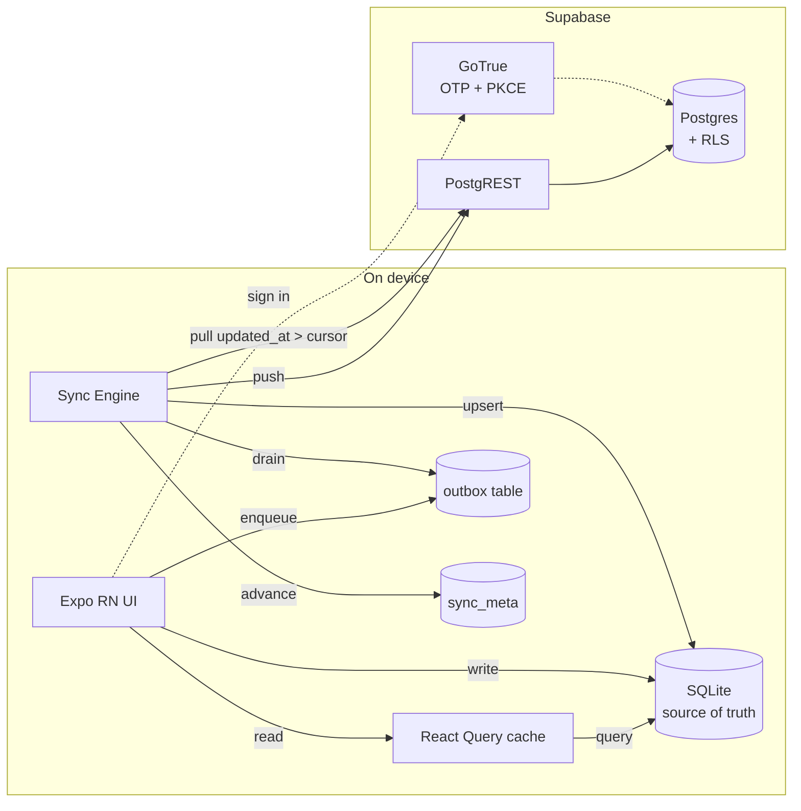
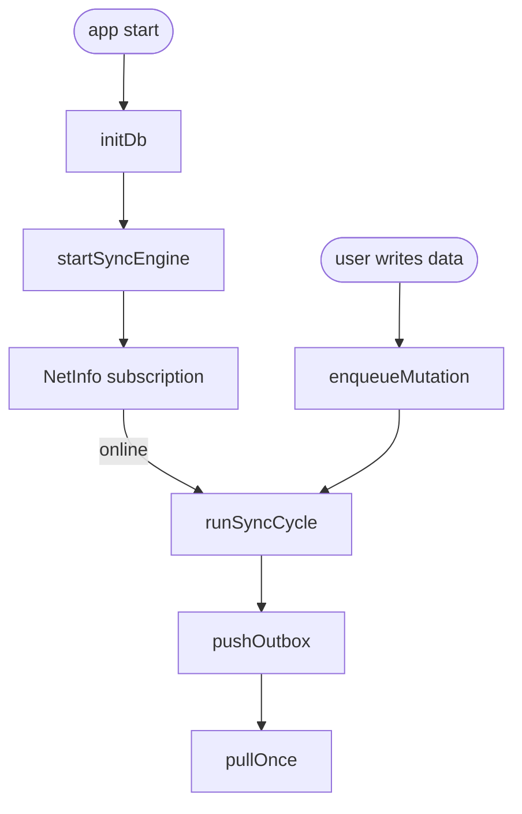
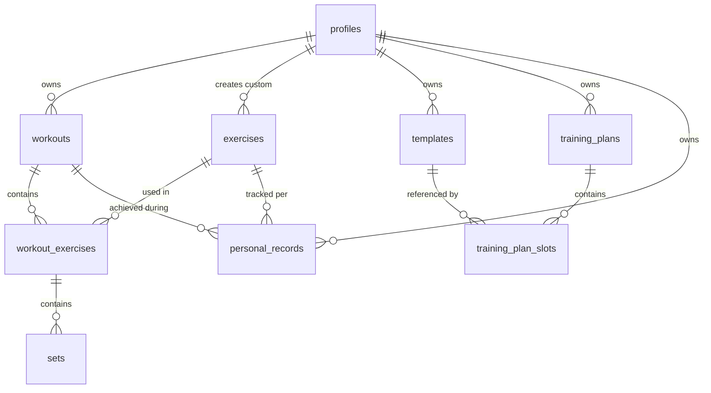
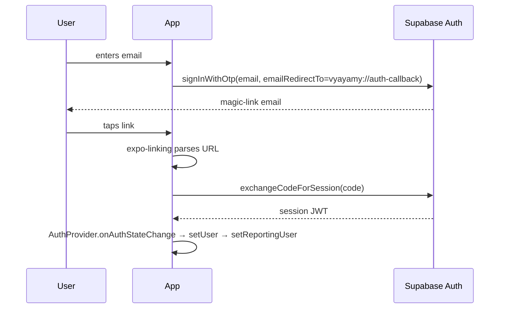

# Architecture

Vyayamy is a mobile-only, **local-first** strength-training journal. The client owns the data during a session: every user action commits to SQLite synchronously, and the sync engine propagates those writes to Supabase in the background. The network is never in the critical path of logging a set.

---

## Table of Contents

1. [System Overview](#system-overview)
2. [High-Level Architecture](#high-level-architecture)
3. [Provider Tree and Navigation](#provider-tree-and-navigation)
4. [Data Layer](#data-layer)
5. [Sync Engine](#sync-engine)
6. [Database Design](#database-design)
7. [Authentication](#authentication)
8. [Personal Record Detection](#personal-record-detection)
9. [Rest Timer and Notifications](#rest-timer-and-notifications)
10. [Error Reporting](#error-reporting)
11. [Design System](#design-system)
12. [Native Health Boundary](#native-health-boundary)
13. [Security Model](#security-model)
14. [Key Design Decisions](#key-design-decisions)

---

## System Overview

The app runs entirely on the user's phone. SQLite, not Supabase, is the source of truth during a session. Supabase is a durable mirror reached only by the sync engine.



Key properties:

- No custom API server
- Writes never block on the network
- Last-write-wins is sufficient — single user, often single device
- Every mutable table carries `updated_at` and `deleted_at`; hard deletes are never issued

---

## High-Level Architecture

| Concern             | Solution                                                                |
| ------------------- | ----------------------------------------------------------------------- |
| UI rendering        | React Native (Expo SDK 51), React 18 functional components              |
| Navigation          | Expo Router (file-based under [app/](app/), typed routes)               |
| Local state         | `useState` / `useReducer` inside components                             |
| Server state        | TanStack React Query 5, backed by SQLite reads                          |
| Local persistence   | `expo-sqlite` ([src/db/](src/db/))                                      |
| Sync                | In-house outbox + incremental pull ([src/sync/](src/sync/))             |
| Auth                | Supabase GoTrue, OTP + PKCE, `expo-linking` deep link exchange          |
| Remote persistence  | Supabase Postgres + PostgREST, reached only by the sync engine          |
| Authorization       | Row Level Security in Postgres                                          |
| Styling             | `StyleSheet.create` + tokens in [src/ui/theme.ts](src/ui/theme.ts)      |
| Charts              | `react-native-svg` via [src/ui/LineChart.tsx](src/ui/LineChart.tsx)     |
| Haptics             | `expo-haptics`                                                          |
| Timers              | `setInterval` foreground, `expo-notifications` for background rest cue  |
| Error reporting     | `@sentry/react-native` gated by DSN                                     |
| Native integrations | HealthKit / Health Connect adapter interface ([src/native/health/](src/native/health/)) |
| Testing             | Jest + `ts-jest`, `better-sqlite3` in-memory mock of `expo-sqlite`      |
| Build / distribution | EAS Build, EAS Submit                                                  |

There is no server-side rendering, no ORM, no middleware, and no custom HTTP layer. UI code does not call `supabase.from()` directly — only the sync engine does.

---

## Provider Tree and Navigation

### Provider Tree

Defined in [app/_layout.tsx](app/_layout.tsx). Order matters:

```
ErrorBoundary
  └─ SafeAreaProvider
       └─ QueryClientProvider       ← TanStack Query cache
            └─ AuthProvider          ← Supabase session + user
                 └─ ToastProvider    ← transient notifications
                      └─ Expo Router <Stack>
```

`RootLayout` also initializes the local database (`initDb()`) and starts the sync engine (`startSyncEngine(queryClient)`) once. Sentry init runs at module load via `initErrorReporting()` and is a no-op if no DSN is configured.

### Navigation

Expo Router maps the filesystem under [app/](app/) to routes:

| Route                   | File                                                       | Notes                       |
| ----------------------- | ---------------------------------------------------------- | --------------------------- |
| `/(tabs)/today`         | [app/(tabs)/today.tsx](app/(tabs)/today.tsx)               | Dashboard                   |
| `/(tabs)/history`       | [app/(tabs)/history.tsx](app/(tabs)/history.tsx)           | Past workouts               |
| `/(tabs)/progress`      | [app/(tabs)/progress.tsx](app/(tabs)/progress.tsx)         | PRs + charts                |
| `/(tabs)/profile`       | [app/(tabs)/profile.tsx](app/(tabs)/profile.tsx)           | Settings                    |
| `/workout/active`       | [app/workout/active.tsx](app/workout/active.tsx)           | Live session                |
| `/history/[id]`         | [app/history/[id].tsx](app/history/[id].tsx)               | Dynamic detail route        |
| `/profile/plan`         | [app/profile/plan/index.tsx](app/profile/plan/index.tsx)   | Training plan               |
| `/profile/plan/setup`   | [app/profile/plan/setup.tsx](app/profile/plan/setup.tsx)   | Plan setup wizard           |
| `/login`                | [app/login.tsx](app/login.tsx)                             | OTP sign-in                 |
| `*`                     | [app/+not-found.tsx](app/+not-found.tsx)                   | Catch-all                   |

Route files are thin; the real screens live in [src/screens/](src/screens/) and are imported by the route file. This keeps routing declarative and lets screens stay portable across navigation choices.

---

## Data Layer

### Write path

Every user action that touches data calls `enqueueMutation()` in [src/db/mutations.ts](src/db/mutations.ts). Both the local write and the outbox row happen in a single SQLite transaction:

```ts
await db.withTransactionAsync(async () => {
  // 1. Apply the change to the local table (insert/upsert/update/soft-delete)
  // 2. Append one row to the outbox describing the server-side effect
});
```

There is no optimistic/rollback branching in UI code — by the time the function returns, the write is durable locally. The sync engine picks up the outbox asynchronously.

### Read path

Screens consume React Query hooks in [src/queries/](src/queries/). Each hook's `queryFn` reads SQLite via `getDb()` instead of hitting the network:

```ts
return useQuery({
  queryKey: [...WORKOUTS_KEY, 'recent', userId ?? ''],
  queryFn: async () => {
    const db = await getDb();
    return db.getAllAsync<Workout>(
      `SELECT * FROM workouts
         WHERE user_id = ? AND deleted_at IS NULL
         ORDER BY started_at DESC LIMIT 20`,
      [userId],
    );
  },
  enabled: !!userId,
});
```

React Query still earns its keep: cache, dedup, and hook ergonomics across the screen tree. All reads filter `deleted_at IS NULL`; tombstones are visible only to the sync engine.

### Mutations

Mutations wrap `enqueueMutation` and invalidate query keys on success. They never call `supabase.from()` directly — that boundary is enforced by convention and by the lint rule that only [src/sync/](src/sync/) imports from [src/auth/supabase.ts](src/auth/supabase.ts) (outside of auth itself).

---

## Sync Engine

The engine ([src/sync/engine.ts](src/sync/engine.ts)) owns lifecycle:

- Subscribes to `@react-native-community/netinfo` for connectivity
- Triggers a sync cycle on startup, network regain, and auth change
- Coalesces concurrent push/pull runs with in-flight flags
- Publishes state via a lightweight pub/sub in [src/sync/state.ts](src/sync/state.ts) consumed by [src/ui/SyncIndicator.tsx](src/ui/SyncIndicator.tsx)



### Push ([src/sync/push.ts](src/sync/push.ts))

FIFO drain of the outbox. Each row is applied to Supabase via PostgREST:

- `insert` / `upsert` — `tbl.upsert(payload)` or `tbl.insert(payload)`
- `update` — `tbl.update(payload).eq('id', row_id)`
- `delete` — `tbl.update({ deleted_at: now }).eq('id', row_id)` (soft delete only)

On success the outbox row is deleted. On failure `attempts++` and `last_error` are recorded; after `MAX_ATTEMPTS = 5` the row is considered poisoned and surfaced to the UI sync indicator. The loop breaks on the first failure to preserve ordering.

### Pull ([src/sync/pull.ts](src/sync/pull.ts))

For each table in `SYNCED_TABLES` (declared in [src/db/schema.ts](src/db/schema.ts)):

1. Read the high-water mark from `sync_meta`
2. `SELECT * WHERE updated_at > :cursor ORDER BY updated_at LIMIT 500`
3. Upsert each row into local SQLite, **skipping rows that have a pending outbox entry** (local wins until push succeeds)
4. Advance the checkpoint to the max `updated_at` seen

Tombstones (`deleted_at IS NOT NULL`) are pulled too, so deletions propagate across devices without hard-deleting rows.

### Conflict rule

Single-user, last-write-wins by `updated_at`. If a local row has a pending outbox entry, the server version is discarded on pull; the next successful push overwrites the server with the local value.

### Sync state

```ts
interface SyncState {
  online: boolean;
  pushInFlight: boolean;
  pullInFlight: boolean;
  pendingOutbox: number;
  lastPushedAt: string | null;
  lastPulledAt: string | null;
  lastError: string | null;
}
```

`deriveSyncState()` in [src/core/syncHelpers.ts](src/core/syncHelpers.ts) reduces this to a single enum (`idle` / `saving` / `saved` / `error` / `offline`) that the UI renders.

---

## Database Design

### Entity-Relationship Model

The schema is shared between Postgres (authoritative, in [supabase/migrations/](supabase/migrations/)) and SQLite (mirrored in [src/db/schema.ts](src/db/schema.ts)). Table names and columns match 1:1; UUIDs are `TEXT` locally, timestamps are ISO-8601 `TEXT`.



### Table descriptions

| Table                | Purpose                                                                 |
| -------------------- | ----------------------------------------------------------------------- |
| `profiles`           | Extends `auth.users`; display name + units preference                   |
| `exercises`          | Catalog; `user_id IS NULL` for global seeded rows, otherwise user-created |
| `workouts`           | Training session with start/end timestamps and optional template link   |
| `workout_exercises`  | Junction: workout ↔ exercise with ordering                              |
| `sets`               | Individual sets (weight, reps, completion)                              |
| `personal_records`   | Best-ever lifts per `(user_id, exercise_id, type)` — unique constraint  |
| `templates`          | Reusable routines (ordered UUID array)                                  |
| `training_plans`     | Weekly or rotating-cycle schedule                                       |
| `training_plan_slots`| Maps each day / cycle position in a plan to a template or rest day      |

### Sync-support columns

Added by `supabase/migrations/00004_sync_support.sql` on every mutable table:

| Column        | Purpose                                                         |
| ------------- | --------------------------------------------------------------- |
| `updated_at`  | Set by a BEFORE UPDATE trigger; used as the pull high-water mark |
| `deleted_at`  | Soft-delete tombstone; application reads filter `IS NULL`       |

Every table also has an `idx_<table>_updated_at` index; incremental pull always queries `WHERE updated_at > :cursor ORDER BY updated_at`.

### Client-only tables

| Table       | Columns                                                                                                  |
| ----------- | -------------------------------------------------------------------------------------------------------- |
| `outbox`    | `id`, `table_name`, `op`, `row_id`, `payload_json`, `created_at`, `attempts`, `last_error`               |
| `sync_meta` | `table_name` (PK), `last_pulled_at`                                                                      |

---

## Authentication

Passwordless email OTP via Supabase GoTrue with PKCE flow. Session tokens persist in `AsyncStorage`; deep link callbacks are handled by `expo-linking`.



Supabase client config ([src/auth/supabase.ts](src/auth/supabase.ts)):

- `storage: AsyncStorage`
- `autoRefreshToken: true`
- `persistSession: true`
- `detectSessionInUrl: false` (Expo handles URLs)
- `flowType: 'pkce'`

The `AuthProvider` ([src/auth/AuthContext.tsx](src/auth/AuthContext.tsx)) subscribes to `onAuthStateChange` and forwards the identity to Sentry via `setUser()` from [src/lib/errorReporting.ts](src/lib/errorReporting.ts).

---

## Personal Record Detection

PR logic runs client-side in [src/core/pr-detection.ts](src/core/pr-detection.ts) after a workout finishes. Because writes go through the outbox, the resulting upsert participates in the same sync path as any other mutation.

Record types:

| Type                  | Value shape                                                    |
| --------------------- | -------------------------------------------------------------- |
| `heaviest_weight`     | `number` — max weight in any completed set                     |
| `best_volume`         | `number` — max single-set volume (weight × reps)               |
| `most_reps_at_weight` | `{ weight, reps }` — highest reps at any weight (ties → heavier) |

Upserts use the unique index `(user_id, exercise_id, type)` on the `personal_records` table.

---

## Rest Timer and Notifications

The foreground rest timer is a classic `setInterval` in [src/ui/hooks/useRestTimer.ts](src/ui/hooks/useRestTimer.ts) that emits a success haptic when it crosses the configured target.

To survive backgrounding and screen lock, the same hook schedules a local notification via [src/lib/restNotifications.ts](src/lib/restNotifications.ts):

1. `start()` requests permission if needed, schedules a one-shot notification in `targetSeconds`, and records the id
2. `stop()` / unmount cancels the pending notification
3. Permission denials, web, and Expo Go fall back to a no-op — the foreground timer is authoritative

---

## Error Reporting

[src/lib/errorReporting.ts](src/lib/errorReporting.ts) wraps `@sentry/react-native`:

- `initErrorReporting()` at module load in [app/_layout.tsx](app/_layout.tsx); returns early if `EXPO_PUBLIC_SENTRY_DSN` is not set
- `captureException(err, extra?)` is called by the root [src/ui/ErrorBoundary.tsx](src/ui/ErrorBoundary.tsx) and by any code path that wants to annotate a failure
- `setUser(user)` is called on `onAuthStateChange` so crash reports carry identity

EAS production builds upload source maps via the `@sentry/react-native/expo` config plugin when `SENTRY_ORG`, `SENTRY_PROJECT`, and `SENTRY_AUTH_TOKEN` are supplied.

---

## Design System

All visual tokens live in [src/ui/theme.ts](src/ui/theme.ts) as a plain TypeScript object (color, space, radius, font, touch, duration). Styles are built with `StyleSheet.create`. No CSS files ship in the mobile app.

```ts
const styles = StyleSheet.create({
  card: {
    backgroundColor: theme.color.surface,
    borderRadius: theme.radius.md,
    padding: theme.space.s4,
    borderWidth: 1,
    borderColor: theme.color.border,
  },
});
```

Rules:

- Single column, phone-first; no tablet-specific layouts yet
- 44pt minimum touch target (`theme.touch.min`) on everything interactive
- Warm-neutral palette (stone/amber); dark palette is defined but not toggled yet
- System font (React Native default → San Francisco on iOS, Roboto on Android)
- Motion is subtle: 150–350 ms tokens in `theme.duration`

Charts are in-house SVG — [src/ui/LineChart.tsx](src/ui/LineChart.tsx) renders trend lines with `react-native-svg` primitives. Recharts was not ported (no RN support) and `victory-native` was skipped to avoid React-version conflicts with Expo 51.

See [docs/design-system.md](docs/design-system.md) for the full spec.

---

## Native Health Boundary

[src/native/health/](src/native/health/) defines a platform-agnostic `HealthAdapter` interface ([types.ts](src/native/health/types.ts)) with three implementations:

| Platform     | File                                                     | Status                       |
| ------------ | -------------------------------------------------------- | ---------------------------- |
| iOS          | [src/native/health/ios.ts](src/native/health/ios.ts)     | Stub; wires to `react-native-health` when enabled |
| Android      | [src/native/health/android.ts](src/native/health/android.ts) | Stub; wires to `react-native-health-connect` |
| Fallback     | [src/native/health/noop.ts](src/native/health/noop.ts)   | Always returns `isAvailable = false` |

`getHealthAdapter()` in [src/native/health/index.ts](src/native/health/index.ts) dispatches by `Platform.OS`. Nothing else in the app imports the native modules directly — the rest of the code treats Health as an optional dependency that may or may not be available.

---

## Security Model

### Row Level Security

Unchanged from the pre-pivot schema. Every table has RLS enabled; policies scope rows to `auth.uid()`. Tombstoned rows remain visible to the owner so the sync engine can propagate deletes; application code adds `WHERE deleted_at IS NULL` for normal reads.

### Token handling

The Supabase JS client manages JWT storage in `AsyncStorage` and handles refresh automatically. The anon key is safe to ship in the client bundle — it only grants access permitted by RLS policies.

### Data isolation

- All tables (except global `exercises` where `user_id IS NULL`) are scoped to the authenticated user
- The sync engine respects RLS — every PostgREST call carries the user's JWT
- Local SQLite is per-device and cleared on sign-out (future polish) or app uninstall

---

## Key Design Decisions

### Why SQLite as source of truth, not Supabase?

Lifting in a gym is a place where the network is unreliable. A user logging a set should never see a spinner. SQLite writes finish in microseconds and survive app kills; sync becomes a background concern. This is the single most important architectural choice in the app.

### Why an outbox instead of CRDTs or a heavier sync library?

The product is effectively single-user, often single-device. Last-write-wins is correct. An outbox of explicit mutations is the smallest abstraction that survives offline, retries, and poisoned writes — and it keeps the server boring (plain PostgREST). WatermelonDB-style frameworks would add dependency weight and opacity without solving a problem we have.

### Why React Query on top of a local DB?

It pays for itself even with no HTTP: cache coherence across screens, `invalidateQueries` after a mutation, dedup of repeated reads, and the `useQuery` ergonomic. The alternative (raw `useEffect` + `useState`) reinvents all of this.

### Why a custom SVG chart instead of `victory-native`?

`victory-native` pins `react@>=19` and conflicts with Expo 51's locked `react@18.2`. The chart surfaces are small (line + points + axis) and render cleanly with ~80 lines of `react-native-svg`. Pinning charts to a big library isn't worth the dependency pain.

### Why `ts-jest` + `better-sqlite3` for tests?

`jest-expo` tries to load `expo-modules-core`'s ESM web bundle under Node and fails. `ts-jest` runs TypeScript directly with a Node test environment, and a module mock swaps `expo-sqlite` for in-memory `better-sqlite3`. This lets the sync engine be exercised end-to-end without a simulator.

### Why defer HealthKit / Health Connect?

The native health SDKs require a dev client and platform-specific permissions. Scaffolding the adapter now behind a clean interface means flipping them on is localized work — not an architectural change.
