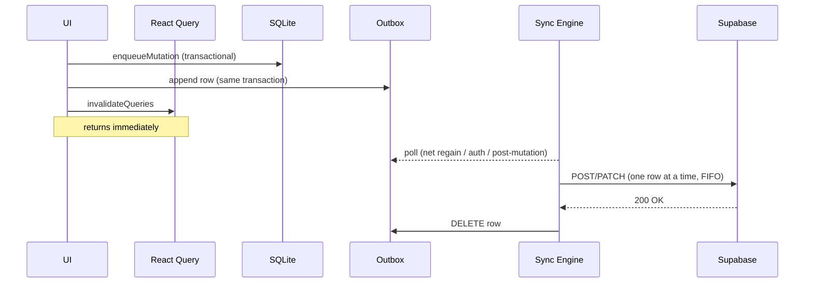
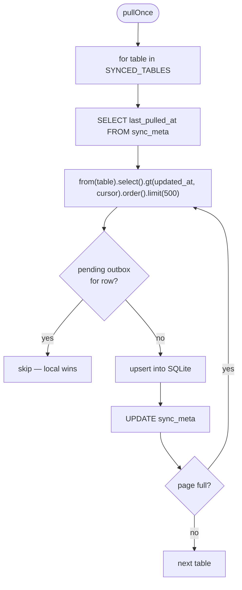

# Local-First Sync

Vyayamy is a local-first app. SQLite on the device is the source of truth during a session; Supabase is a durable mirror. The UI never blocks on the network. This doc explains how that works end-to-end and how to extend the sync engine safely.

## Principles

1. **Writes are synchronous and local.** The UI commits to SQLite before the function returns; there is no optimistic/rollback pattern to reason about.
2. **Every mutation is recorded in an outbox.** The outbox is the ground truth of "what needs to be told to the server".
3. **Pull is incremental by `updated_at`.** No `LIMIT 1000` snapshots, no "pull everything on launch".
4. **Tombstones, not hard deletes.** Every table has `deleted_at`; hard deletes would silently drop from incremental pull.
5. **Last-write-wins, by `updated_at`.** Single user, often single device — this is sufficient and explainable.

## Write Path



The primitive is `enqueueMutation()` in [src/db/mutations.ts](../src/db/mutations.ts):

```ts
export async function enqueueMutation(args: EnqueueArgs): Promise<void> {
  const db = await getDb();
  const now = nowIso();
  await db.withTransactionAsync(async () => {
    // 1. Apply to local table
    //    - insert / upsert: full row with updated_at = now
    //    - update:          patch columns + updated_at = now
    //    - delete:          soft delete (deleted_at = now, updated_at = now)
    // 2. Append one outbox row describing the server-side effect
  });
}
```

## Outbox

Defined in [src/db/schema.ts](../src/db/schema.ts):

```sql
CREATE TABLE outbox (
  id INTEGER PRIMARY KEY AUTOINCREMENT,
  table_name  TEXT NOT NULL,
  op          TEXT NOT NULL,   -- 'insert' | 'upsert' | 'update' | 'delete'
  row_id      TEXT NOT NULL,   -- the row's UUID
  payload_json TEXT NOT NULL,  -- stringified server payload
  created_at  TEXT NOT NULL,
  attempts    INTEGER NOT NULL DEFAULT 0,
  last_error  TEXT
);
```

Rules:

- FIFO drain. The push loop reads `ORDER BY id ASC LIMIT 1` and stops on the first failure — order is preserved.
- `attempts < MAX_ATTEMPTS` (5). After that the row is **poisoned** and stays in the outbox for manual inspection / retry; the UI surfaces this via [src/ui/SyncIndicator.tsx](../src/ui/SyncIndicator.tsx).
- The outbox is **never** truncated automatically. Draining on success is the only way rows leave.

## Push

[src/sync/push.ts](../src/sync/push.ts) drains the outbox against Supabase PostgREST:

| Op       | Supabase call                                                   |
| -------- | --------------------------------------------------------------- |
| `insert` | `from(tbl).insert(payload)`                                     |
| `upsert` | `from(tbl).upsert(payload)`                                     |
| `update` | `from(tbl).update(payload).eq('id', row_id)`                    |
| `delete` | `from(tbl).update({ deleted_at: now }).eq('id', row_id)`        |

On success the outbox row is deleted. On failure `attempts++` and `last_error = <message>`; the loop breaks to preserve ordering. After the drain, `pendingOutbox` and `lastPushedAt` are published to sync state.

## Pull

[src/sync/pull.ts](../src/sync/pull.ts) fetches incremental updates for each synced table.



- `sync_meta.last_pulled_at` stores the per-table cursor
- Pages of 500 rows; loop until a page is non-full
- Rows with a matching pending outbox entry are **skipped** on pull — the local write has not yet reached the server, so the server's version is stale
- Tombstones (`deleted_at IS NOT NULL`) are pulled too — this is how deletions propagate

## Triggers

The sync engine ([src/sync/engine.ts](../src/sync/engine.ts)) runs a cycle (push then pull) on:

1. **App startup** — `startSyncEngine(queryClient)` in the root layout
2. **Network regain** — subscribed via `@react-native-community/netinfo`
3. **Auth change** — after `signInWithOtp` completes and a session appears
4. **Post-mutation** — callers can invoke `triggerPush()` directly after an `enqueueMutation` for snappier propagation

Concurrent cycles are coalesced via `pushInFlight` / `pullInFlight` flags.

## Sync State

A lightweight pub/sub in [src/sync/state.ts](../src/sync/state.ts):

```ts
interface SyncState {
  online: boolean;
  pushInFlight: boolean;
  pullInFlight: boolean;
  pendingOutbox: number;
  lastPushedAt: string | null;
  lastPulledAt: string | null;
  lastError: string | null;
}
```

`deriveSyncState(state)` in [src/core/syncHelpers.ts](../src/core/syncHelpers.ts) reduces this to a single enum for the UI:

| State     | Meaning                                       |
| --------- | --------------------------------------------- |
| `idle`    | Nothing pending, nothing in flight            |
| `saving`  | A push or pull is in flight                   |
| `saved`   | Last push succeeded (flashes briefly)         |
| `error`   | At least one poisoned row in outbox           |
| `offline` | Device is offline                             |

## Database Requirements

Every synced table **must** have:

- `updated_at TIMESTAMPTZ NOT NULL DEFAULT now()` with a `BEFORE UPDATE` trigger calling `public.set_updated_at()`
- `deleted_at TIMESTAMPTZ` nullable (NULL = live row)
- Index on `updated_at` (`idx_<table>_updated_at`)
- RLS policies scoped to `auth.uid()` that **do not** filter `deleted_at` — tombstones must be visible to the owner

Template: [supabase/migrations/00004_sync_support.sql](../supabase/migrations/00004_sync_support.sql).

Application reads **must** filter `WHERE deleted_at IS NULL` at the query layer.

## Adding a New Synced Table End-to-End

Worked example for a hypothetical `workout_notes` table:

1. **Postgres migration** — add the table with `updated_at` + `deleted_at`, attach the `set_updated_at` trigger, add the index, define RLS policies scoped to `user_id = auth.uid()`.

2. **Local schema mirror** — in [src/db/schema.ts](../src/db/schema.ts), add the `CREATE TABLE workout_notes (...)` with the same columns (UUIDs as `TEXT`, timestamps as ISO-8601 `TEXT`). Add `'workout_notes'` to `SYNCED_TABLES`.

3. **TypeScript types** — in [src/db/types.ts](../src/db/types.ts), add `workout_notes: { Row: ..., Insert: ..., Update: ... }` to `Database['public']['Tables']` and export a convenience alias at the bottom.

4. **Query module** — create `src/queries/workoutNotes.ts`. Reads use `getDb()` + `WHERE deleted_at IS NULL`; writes call `enqueueMutation({ table: 'workout_notes', ... })`. Define keys in [src/queries/keys.ts](../src/queries/keys.ts).

5. **UI** — wire the hook into whichever screen needs it.

The push and pull engines are driven entirely by `SYNCED_TABLES`. No engine code needs to change.

## Testing

[src/__tests__/offline-workout.test.ts](../src/__tests__/offline-workout.test.ts) exercises the full path:

1. Simulate offline (`setSyncState({ online: false })`)
2. Run a sequence of local writes (create workout → add exercise → add sets → finish)
3. Verify SQLite state and outbox contents
4. Simulate online + call `pushOutbox()` with a mocked Supabase client
5. Verify outbox drains and error paths increment `attempts` / set `last_error`

The test backend is [better-sqlite3](https://github.com/WiseLibs/better-sqlite3) wired as a Jest mock for `expo-sqlite` in [src/db/__mocks__/expo-sqlite.ts](../src/db/__mocks__/expo-sqlite.ts). Jest itself runs under `ts-jest` in a Node environment — see [package.json](../package.json).

## Intentionally Deferred

| Item                                             | Why                                                                                       |
| ------------------------------------------------ | ----------------------------------------------------------------------------------------- |
| Operation batching within a cycle                | FIFO single-row push is fast enough and trivially correct. Revisit if we measure latency pain. |
| Retry with exponential backoff                   | Current model: stop on first failure and wait for the next trigger. Simpler to reason about. |
| Automatic poisoned-row dropping                  | We would rather leak a poisoned row forever than discard user data silently. Manual recovery is a future UI task. |
| Multi-device conflict detection beyond LWW       | Single-user semantics make this noise. Add only when real conflicts appear in production. |
| Compaction of the outbox on sign-out             | Sign-out flow is not finalized. Keep the data; scrub later.                               |
