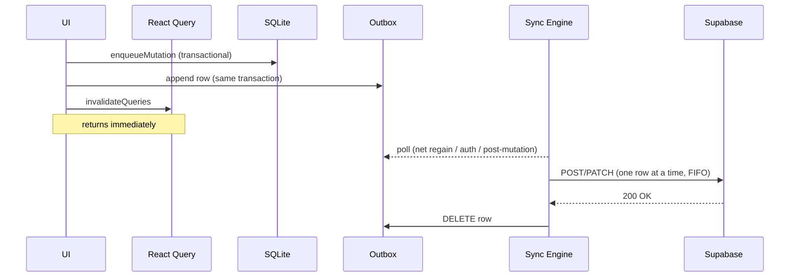
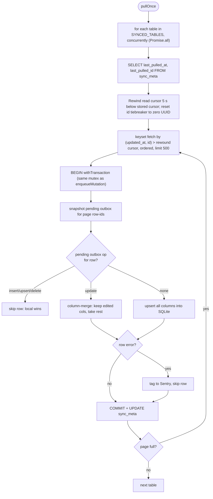

# Local-First Sync

FlexYug is a local-first app. SQLite on the device is the source of truth during a session; Supabase is a durable mirror. The UI never blocks on the network. This doc explains how that works end-to-end and how to extend the sync engine safely.

## Principles

1. **Writes are synchronous and local.** The UI commits to SQLite before the function returns; there is no optimistic/rollback pattern to reason about.
2. **Every mutation is recorded in an outbox.** The outbox is the ground truth of "what needs to be told to the server".
3. **Pull is incremental by `updated_at`.** No `LIMIT 1000` snapshots, no "pull everything on launch".
4. **Tombstones, not hard deletes.** Every table has `deleted_at`; hard deletes would silently drop from incremental pull.
5. **Last-write-wins, by `updated_at`.** Single user, often single device, so this is sufficient and explainable.

## Write Path



The primitive is `enqueueMutation()` in [src/db/mutations.ts](../src/db/mutations.ts):

```ts
export async function enqueueMutation(args: EnqueueArgs): Promise<void> {
  const db = await getDb();
  const now = nowIso();
  await withTransaction(db, async () => {
    // 1. Apply to local table
    //    - insert / upsert: full row with updated_at = now
    //    - update:          patch columns + updated_at = now
    //    - delete:          soft delete (deleted_at = now, updated_at = now)
    // 2. For parent deletes, cascade soft-delete FK children + enqueue child
    //    deletes in the same transaction (SOFT_DELETE_CASCADE).
    // 3. Append one outbox row describing the server-side effect.
  });
  // The write committed: emit so the engine can debounce a push (#34).
  emitMutationCommitted();
}
```

## Outbox

Defined in [src/db/schema.ts](../src/db/schema.ts):

```sql
CREATE TABLE outbox (
  id INTEGER PRIMARY KEY AUTOINCREMENT,
  table_name  TEXT NOT NULL,
  op          TEXT NOT NULL,   -- 'insert' | 'upsert' | 'update' | 'delete'
  row_id      TEXT NOT NULL,   -- the row's UUID
  payload_json TEXT NOT NULL,  -- stringified server payload
  created_at  TEXT NOT NULL,
  attempts    INTEGER NOT NULL DEFAULT 0,
  next_attempt_at TEXT,            -- backoff gate: a row is read only when next_attempt_at <= now
  last_error  TEXT
);
```

Rules:

- FIFO drain with per-row ordering. A row is eligible when `attempts < MAX_ATTEMPTS`, `next_attempt_at <= now`, and no earlier outbox entry exists for the same `(table_name, row_id)` (the `NOT EXISTS ... e.id < o.id` gate in `push.ts:159-162`). Eligible rows are read `ORDER BY id ASC LIMIT 50`. `pushOutbox` repeats drain passes while a pass ships at least one row, so an outbox larger than 50 fully drains in one cycle and a row's later ops become eligible as earlier siblings ship (see `push.ts:112-117`).
- Per-row exponential backoff with skip-and-continue: a non-transient failure increments `attempts` and sets `next_attempt_at = now + min(2^attempts s, 30s)`. A row in its backoff window is left behind; the drain never blocks on it. After each drain, the engine schedules a single retry timer for the earliest `next_attempt_at` among backed-off rows (via `__setRetryScheduler`, `push.ts:134-143`, `engine.ts:84-90`), so a backed-off row self-recovers without waiting for a user action or network event.
- Transient failures (401/403, 5xx, 429/rate-limit, network/timeout, expired JWT) are not counted against `attempts`. They surface to the UI as `lastError`. The transient list is checked by `isTransientError` in `push.ts:69-94`.
- `attempts < MAX_ATTEMPTS` (5). After that the row is **poisoned** and stays in the outbox for manual inspection / retry; the UI surfaces this via `QuarantineBanner` / `QuarantineSheet`.
- The outbox is **never** truncated automatically. Draining on success is the only way rows leave.

## Push

[src/sync/push.ts](../src/sync/push.ts) drains the outbox against Supabase PostgREST:

| Op       | Supabase call                                                                       |
| -------- | ----------------------------------------------------------------------------------- |
| `insert` | `from(tbl).upsert(payload)` (insert sent as upsert-by-PK: a retry after a kill-mid-ack never produces a 23505 collision) |
| `upsert` | `from(tbl).upsert(payload)`                                                         |
| `update` | `from(tbl).update(payload).eq('id', row_id).select('id')` with a matched-row assertion |
| `delete` | `from(tbl).update({ deleted_at: now }).eq('id', row_id).select('id')` with the same assertion |

A zero-row match on `update` or `delete` throws non-transitively (the row is absent server-side when it should not be), so the write marches toward quarantine rather than being silently dropped (`assertServerRowMatched`, `push.ts:254-259`). `updated_at` is never sent: the `00009` `BEFORE INSERT OR UPDATE` trigger is authoritative (`SERVER_OWNED_COLUMNS`, `push.ts:53`).

On success the outbox row is deleted. On non-transient failure, `attempts++`, `last_error = <message>`, and `next_attempt_at` is set to the per-row backoff window; the loop continues to the next row rather than breaking. Transient errors log `last_error` without incrementing `attempts`. After the drain, `pendingOutbox`, `quarantinedOutbox`, and `lastPushedAt` are published to sync state.

All upserts currently target the PK (`id`); `UPSERT_CONFLICT_TARGET` in `push.ts:50` is an empty object and no table overrides it. `personal_records` was demoted to a local-only derived cache recomputed from synced sets (see `src/queries/personalRecords.ts`, `#138`) and is absent from `SYNCED_TABLES` (`src/db/schema.ts:210-223`). The dormant composite-key reconcile machinery (`UPSERT_CONFLICT_TARGET` + `reconcileLocalRowId`, gated by `RECONCILE_SAFE_TABLES`) exists in `push.ts` for any future composite-unique table.

## Quarantine & Recovery

A row that exhausts `MAX_ATTEMPTS` (5) is **quarantined**: it stays in the outbox and is surfaced to the user. [src/sync/quarantine.ts](../src/sync/quarantine.ts) exposes:

- `getQuarantined()` / `useQuarantined()`: list quarantined rows; `getStaleQuarantined()` flags ones older than 24h for the banner.
- `retryQuarantinedRow(id)` / `retryAllQuarantined()`: reset `attempts` + `next_attempt_at` and re-trigger push.
- `discardQuarantinedRow(id)` / `discardAllQuarantined()`: reconcile local state by op, in one transaction: `insert`/`upsert` → delete the local row, then cascade-hard-delete its FK children and their outbox ops depth-first (`DISCARD_CASCADE`: workouts -> workout_exercises -> sets, training_plans -> training_plan_slots); `delete` → un-tombstone (`deleted_at = NULL`); `update` → leave the user's edit. In all cases every outbox op for the `(table, row_id)` is removed, not only the quarantined entry, so no sibling op is left to fail against the removed row (`quarantine.ts:136-139`). A `SAFE_TABLES` allowlist guards the dynamic-table SQL.

The UI surfaces these through `QuarantineBanner` / `QuarantineSheet`.

## Pull

[src/sync/pull.ts](../src/sync/pull.ts) fetches incremental updates for each synced table.



- Tables are pulled concurrently via `Promise.all` (`pull.ts:73-83`); network fetches are independent and local writes still serialize through the `withTransaction` mutex.
- Per-table fault isolation: a table-level error is caught, tagged to Sentry, and does not starve other tables (`pull.ts:76-83`). Per-row fault isolation: an un-mergeable row is caught and tagged to Sentry so the page transaction commits and the cursor advances past it (`pull.ts:174-181`).
- Cursor rewind: each pull rewinds the read cursor 5 s below the stored cursor (`CURSOR_OVERLAP_MS`) and resets the id tiebreaker to the zero UUID, so the whole window is rescanned for late-arriving rows. The stored cursor still advances to the true last row. Safe because the merge is an idempotent upsert (`pull.ts:49-106`).
- The pending-outbox snapshot is taken inside the merge transaction (`pull.ts:120-125`), serialized with `enqueueMutation` through the same mutex, so a local edit committed between fetch and merge cannot be clobbered.
- The per-table cursor is the composite `(last_pulled_at, last_pulled_id)` in `sync_meta`; the keyset `(updated_at, id)` comparison means rows that share an `updated_at` are never skipped.
- Pages of 500 rows; loop until a page is non-full.
- Conflict resolution is **column-level**: a pending `insert`/`upsert`/`delete` skips the whole row (local wins until the outbox drains); a pending `update` protects only the columns it touched and merges every other column from the server.
- Tombstones (`deleted_at IS NOT NULL`) are pulled too; this is how deletions propagate.

## Triggers

The sync engine ([src/sync/engine.ts](../src/sync/engine.ts)) runs a cycle (push then pull) on:

1. **App startup:** `startSyncEngine(queryClient)` in the root layout.
2. **Network regain:** subscribed via `@react-native-community/netinfo`.
3. **App foreground:** an `AppState` change to `active` re-runs the cycle so data refreshes after the app was backgrounded.
4. **Auth change:** a `SIGNED_IN` or `TOKEN_REFRESHED` event re-runs the cycle; `SIGNED_OUT` wipes local data.
5. **Post-mutation:** `enqueueMutation` emits a `mutation-committed` event on the bus in `src/db/mutationEvents.ts`; the engine subscribes and debounces 50 ms so a burst of writes coalesces into one push (`engine.ts:73-80`). The queries layer no longer imports sync directly (#34).
6. **Backoff retry:** after each drain pass, push schedules a one-shot timer for the earliest `next_attempt_at` among backed-off rows via the engine-injected `__setRetryScheduler` (`engine.ts:84-90`), so a backed-off row self-recovers.

Concurrent cycles are coalesced via `pushInFlight` / `pullInFlight` flags.

## Sync State

A lightweight pub/sub in [src/sync/state.ts](../src/sync/state.ts):

```ts
interface SyncState {
  online: boolean;
  pushInFlight: boolean;
  pullInFlight: boolean;
  pendingOutbox: number;
  quarantinedOutbox: number;
  lastPushedAt: string | null;
  lastPulledAt: string | null;
  lastError: string | null;
  lastErrorAt: string | null;
}
```

`deriveSyncState({ online, pushing, pulling, pendingOutbox, lastError, showSaved })` in [src/core/syncHelpers.ts](../src/core/syncHelpers.ts) reduces this to a single enum for the UI:

| State     | Meaning                                                          |
| --------- | ---------------------------------------------------------------- |
| `idle`    | Nothing pending, nothing in flight                               |
| `saving`  | A push or pull is in flight, or the outbox has pending rows      |
| `saved`   | Last push succeeded (flashes briefly)                            |
| `error`   | `lastError` is set (last push or pull failed)                    |
| `offline` | Device is offline                                                |

Quarantined rows are surfaced separately via `useQuarantined` / `QuarantineBanner` / `QuarantineSheet`, not through this enum.

## Database Requirements

Every synced table **must** have:

- `updated_at TIMESTAMPTZ NOT NULL DEFAULT now()` with a `BEFORE INSERT OR UPDATE` trigger calling `public.touch_updated_at()` (migration `00009` superseded the legacy `BEFORE UPDATE` `set_updated_at()`)
- `deleted_at TIMESTAMPTZ` nullable (NULL = live row)
- Index on `updated_at` (`idx_<table>_updated_at`)
- RLS policies scoped to `auth.uid()` that **do not** filter `deleted_at` (tombstones must be visible to the owner)

Template: [supabase/migrations/00009_security_hardening.sql](../supabase/migrations/00009_security_hardening.sql) for the current server-owned `touch_updated_at` trigger (`00004` introduced the original sync columns).

Application reads **must** filter `WHERE deleted_at IS NULL` at the query layer.

## Adding a New Synced Table End-to-End

Worked example for a hypothetical `workout_notes` table:

1. **Postgres migration:** add the table with `updated_at` + `deleted_at`, attach the `touch_updated_at` trigger, add the index, define RLS policies (USING + WITH CHECK) scoped to `user_id = auth.uid()`.

2. **Local schema mirror:** in [src/db/schema.ts](../src/db/schema.ts), add the `CREATE TABLE workout_notes (...)` with the same columns (UUIDs as `TEXT`, timestamps as ISO-8601 `TEXT`). Add `'workout_notes'` to `SYNCED_TABLES`.

3. **TypeScript types:** in [src/db/types.ts](../src/db/types.ts), add `workout_notes: { Row: ..., Insert: ..., Update: ... }` to `Database['public']['Tables']` and export a convenience alias at the bottom.

4. **Query module:** create `src/queries/workoutNotes.ts`. Reads use `getDb()` + `WHERE deleted_at IS NULL`; writes call `enqueueMutation({ table: 'workout_notes', ... })`. Define keys in [src/queries/keys.ts](../src/queries/keys.ts).

5. **UI:** wire the hook into whichever screen needs it.

The push and pull engines are driven entirely by `SYNCED_TABLES`. No engine code needs to change.

## Testing

[src/__tests__/offline-workout.test.ts](../src/__tests__/offline-workout.test.ts) exercises the full path:

1. Simulate offline (`setSyncState({ online: false })`)
2. Run a sequence of local writes (create workout → add exercise → add sets → finish)
3. Verify SQLite state and outbox contents
4. Simulate online + call `pushOutbox()` with a mocked Supabase client
5. Verify outbox drains and error paths increment `attempts` / set `last_error`

The test backend is [better-sqlite3](https://github.com/WiseLibs/better-sqlite3) wired as a Jest mock for `expo-sqlite` in [src/db/__mocks__/expo-sqlite.ts](../src/db/__mocks__/expo-sqlite.ts). Jest itself runs under `ts-jest` in a Node environment; see [package.json](../package.json).

## Intentionally Deferred

| Item                                             | Why                                                                                       |
| ------------------------------------------------ | ----------------------------------------------------------------------------------------- |
| Operation batching across rows (single PostgREST round trip) | Per-row drain at BATCH_LIMIT=50 is fast enough today. Revisit if we measure latency pain.    |
| Automatic poisoned-row dropping                  | We'd rather leak a poisoned row than silently discard user data. Manual recovery shipped (quarantine banner/sheet: retry or op-aware discard); fully *automatic* dropping stays deferred. |
| Multi-device conflict detection beyond LWW       | Single-user semantics make this noise. Add only when real conflicts appear in production. |
| Compaction of long-tombstoned rows               | Soft-deleted rows live forever today. Defer GC until storage volume justifies it; see [ADR-0003](adr/0003-soft-delete-tombstones.md). |
