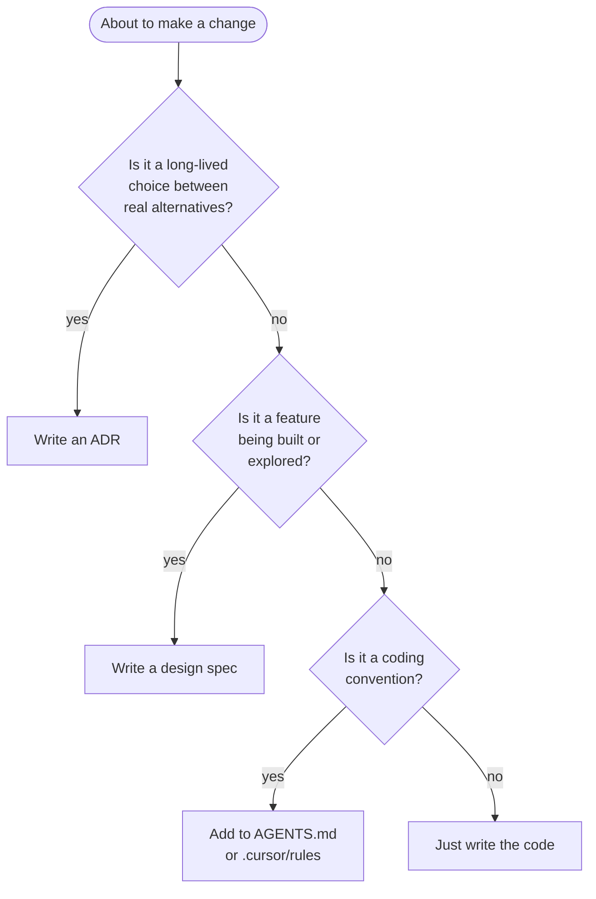

# Docs Uplevel: ADRs + Design Specs

- **Status:** approved
- **Date:** 2026-05-26
- **Related ADRs:** none (this spec creates the system that will hold them)

## Problem

FlexYug's documentation is healthy descriptive prose — README, ARCHITECTURE, AGENTS, plus four topic files under `docs/`. Together they accurately describe **what the system is today**. They are weak in two specific ways:

1. **Architectural decisions are buried.** The "Key Design Decisions" section at the bottom of `ARCHITECTURE.md` lists why SQLite is source of truth, why an outbox over CRDTs, why custom SVG charts, why `ts-jest`. These are foundational choices, but they live as prose paragraphs in a long file. There's no immutable record of when they were made, what alternatives were rejected, and what would have to be true to revisit them. Future-us (and AI agents) cannot find them by name.

2. **Features are built without a written design phase.** There is no convention for "before we build feature X, here is what we are building and why". The deferred-work backlog in `docs/local-first-sync.md` (operation batching, exponential backoff, poisoned-row recovery UI, multi-device conflict detection) and `docs/design-system.md` (dark-mode activation, Sheet/ConfirmDialog primitives, skeletons) all describe *intent to build* without any written design preceding implementation.

The result: decisions are rediscovered instead of remembered, and features are designed in the editor at implementation time.

## Goals & non-goals

**Goals**

- Stand up a lightweight, two-doc-type system: **ADRs** for foundational decisions, **design specs** for per-feature designs.
- Backfill four ADRs from existing prose so the system ships populated, not empty.
- Define clear rules for when each doc type applies, so the system stays in use.
- Touch existing docs minimally — they're well-tuned; they get pointers, not rewrites.
- Make agents (this assistant included) first-class consumers — `AGENTS.md` points at the spec system as a precondition for non-trivial feature work.

**Non-goals**

- Rewriting or restructuring the four existing topic docs (`overview.md`, `local-first-sync.md`, `operations.md`, `design-system.md`). They stay.
- Writing a first design spec for any backlog feature. That happens organically when the feature is picked up.
- A separate RFC track. The "exploratory" role is absorbed into spec lifecycle (`Status: draft`).
- Operational maturity work (runbooks, threat model, perf budgets, on-call). Out of scope for this pass; flagged as future work.
- Changing the product, the code, or any migration.

## Design

### Two doc types

| Type | Lives in | Triggers | Lifecycle | Mutability |
| --- | --- | --- | --- | --- |
| **ADR** | `docs/adr/NNNN-slug.md` | A non-trivial decision is made (pick X over Y) for a long-lived choice | `proposed → accepted → superseded` | Immutable once accepted; never edited, only superseded by a new ADR |
| **Design spec** | `docs/specs/YYYY-MM-DD-topic.md` | A feature is about to be built (or explored) | `draft → approved → implemented → archived` | Edited freely while in draft / approved; frozen on implementation |

### Decision flow



### When to use which — heuristics

- **"Is this an ADR or a design spec?"** — If the artifact you'd write is *mostly* "we will use X over Y", it's an ADR. If it's *mostly* "here is how the feature works", it's a spec. A spec **uses** ADRs as constraints; it doesn't **make** them.
- **"Is this an ADR or just a code comment?"** — If you can change it later without breaking consumers and without anyone asking "why was it like this?", it's a code comment. ADRs are for choices that have gravity.
- **"Is this an exploratory spec or premature?"** — A `Status: draft` spec is the right home for "I'm thinking about this; I may not ship it". The spec can be abandoned (`Status: archived` with a note in the body). No separate RFC track.

### Cross-references are mandatory

This is what makes the system worth the trouble. Without links, the docs are a junk drawer.

- A design spec that depends on a constraint **links the relevant ADR(s)** in its header.
- An ADR that supersedes another **references the superseder** in its status line; the new ADR references the old one in its body.
- A spec that flips status (draft → approved → implemented) keeps its status line current; the index in `docs/specs/README.md` mirrors that.

### Templates

**ADR template** (`docs/adr/TEMPLATE.md`, MADR-lite, ~1 page, immutable once accepted):

```markdown
# ADR-NNNN: <decision in one line>

- **Status:** proposed | accepted | superseded by [ADR-XXXX](XXXX-…md)
- **Date:** YYYY-MM-DD

## Context

The forces at play — constraints, requirements, what made this choice necessary.

## Decision

We will <chosen option>.

## Alternatives considered

- **<Option A>** — why not.
- **<Option B>** — why not.

## Consequences

- Positive: …
- Negative: …
- Follow-ups: links to related ADRs / specs.
```

**Design spec template** (`docs/specs/TEMPLATE.md`, per-feature, frozen on implementation):

```markdown
# <Feature name>

- **Status:** draft | approved | implemented | archived
- **Date:** YYYY-MM-DD
- **Related ADRs:** [ADR-NNNN](…)

## Problem

What user/system need does this serve?

## Goals & non-goals

- Goal: …
- Non-goal: …

## Design

Components, data flow, UI states, error cases. Diagrams welcome.

## Alternatives considered

Options not taken, and why. (Folds in the "RFC" role — exploratory specs live and possibly die here.)

## Testing

What we'll test and at what layer (unit / integration / device).

## Rollout

Flagging, migration order, fallback. Skip if N/A.

## Open questions

Unresolved at draft time.
```

### Index pages

Each subdirectory carries a `README.md` index:

- **`docs/adr/README.md`** — short rationale ("why ADRs"), one-line table of all ADRs with title and status, a "when to write one" pointer, status legend.
- **`docs/specs/README.md`** — short rationale, one-line table of all specs with status, lifecycle diagram, "when to write one" pointer.

These index pages are updated by the author of each new ADR/spec in the same commit. No automation in this pass.

### Backfilled ADRs

Four ADRs, extracted from existing prose in `ARCHITECTURE.md` and the migration history. All start at `Status: accepted` with their actual decision date (best estimate from git history; the date column reflects when the decision was made, not when the ADR was written).

| # | Title | Source |
| --- | --- | --- |
| 0001 | SQLite as source of truth | `ARCHITECTURE.md` "Key Design Decisions" §1; product principle "Mobile-only, always" |
| 0002 | Outbox over CRDTs / sync frameworks | `ARCHITECTURE.md` "Key Design Decisions" §2 |
| 0003 | Soft-delete tombstones, never hard delete | `docs/local-first-sync.md` "Principles" §4; implicit in `00004_sync_support.sql` |
| 0004 | Server-owned `updated_at` | `supabase/migrations/00009_security_hardening.sql`; called out explicitly in push engine doc |

Excluded from this backfill (could be added later if they earn it): React Query over local DB, custom SVG charts, `ts-jest` over `jest-expo`. These are pragmatic engineering picks; they fit in code comments and the existing ARCHITECTURE prose rather than as standalone ADRs.

### Touches to existing docs

Minimal, surgical edits:

- **`ARCHITECTURE.md`** — the entire "Key Design Decisions" section (~20 lines at the bottom) is replaced with a pointer to `docs/adr/`. Highlight the four ADRs by name. The decision content moves to the ADRs; this file stays focused on "how it works today".
- **`AGENTS.md`** — adds a new section near the top: agents check `docs/specs/` before implementing a non-trivial feature; if there's no spec, agents invoke the brainstorming flow rather than improvising. ADRs are read-only for agents — never written autonomously.
- **`README.md`** — two entries added to the "Key entry points" list at the bottom: `docs/adr/` and `docs/specs/`.

**Not touched:** `docs/overview.md`, `docs/local-first-sync.md`, `docs/operations.md`, `docs/design-system.md`. They are well-tuned and orthogonal.

## Alternatives considered

- **Three-doc system: ADR + design spec + RFC.** First proposal had RFCs as a separate track for proposals that might be rejected. Folded into design specs via `Status: draft` to reduce ceremony. RFC role survives; the directory does not.
- **Single `docs/decisions/` umbrella holding both ADRs and specs.** Rejected: ADRs and specs have different lifecycles (immutable vs mutable) and different naming (sequential vs date). Separating them makes those differences enforceable by convention.
- **Date-based ADR naming (`2026-05-26-sqlite-as-truth.md`).** Rejected: ADRs are an ordered ledger; sequential numbering is the de-facto convention (Nygard, MADR, adr-tools) and makes references stable across renames.
- **Backfill everything (15+ decisions).** Rejected: high risk of inventing rationale that wasn't actually present at the time. Four foundational ADRs is enough to populate the system credibly.
- **No backfill — forward-only.** Rejected: the system would ship empty and likely rot. Backfilling four ADRs makes the system feel real on day one and demonstrates the template by example.
- **`docs/superpowers/specs/` for design specs (brainstorming skill default).** Rejected for project-level specs: namespacing under `superpowers/` couples the project's spec system to a specific tool. `docs/specs/` is tool-agnostic.

## Testing

This is a documentation change with no code impact, so "testing" is editorial:

- **Templates render correctly on GitHub** — Mermaid blocks, tables, and relative links display as intended.
- **All cross-references resolve** — each ADR linked from `ARCHITECTURE.md` exists; each spec template link in `AGENTS.md` resolves; the README pointer list is accurate.
- **Backfilled ADRs are faithful to existing prose** — a reader who knows the original "Key Design Decisions" section should recognize each ADR as a re-presentation, not a rewrite that changes the meaning.
- **Index pages match the directory contents** — `docs/adr/README.md` lists exactly the four backfilled ADRs; `docs/specs/README.md` lists this spec (the inaugural inhabitant of the system).

No automated check in this pass. A future spec could propose a tiny CI step that fails if an ADR file exists without an entry in the index, but that's overkill for two docs and four ADRs.

## Rollout

One commit, ordered to avoid dangling references mid-tree:

1. **Templates first** — `docs/adr/TEMPLATE.md`, `docs/specs/TEMPLATE.md`. Cheap; reviewers can eyeball shape.
2. **Index pages** — `docs/adr/README.md`, `docs/specs/README.md`. The spec index gets one entry: this design doc.
3. **Backfilled ADRs** — `0001` through `0004`, in order.
4. **Edits to existing docs** — `ARCHITECTURE.md`, `AGENTS.md`, `README.md`. Done last so pointers never refer to files that don't exist yet.

No feature flag, no migration. The change is purely additive plus three small in-place edits.

## Open questions

- **Should the four backfilled ADRs' dates reflect when the decision was *actually* made, or the date this spec lands?** Leaning: best-estimate actual date from git history (more honest; users can still see the ADR was filed retrospectively because its commit lands in 2026-05-26).
- **Status of this spec after implementation.** Once the implementation plan ships, this spec flips to `Status: implemented`. The spec itself stays in `docs/specs/` as the historical record of how the system was stood up.
- **First real design spec.** Not part of this rollout. The deferred-work backlog (poisoned-row recovery UI, dark-mode activation, exponential backoff, multi-device conflict detection) is the natural pool. Whichever is picked up next gets the first "real" spec.
