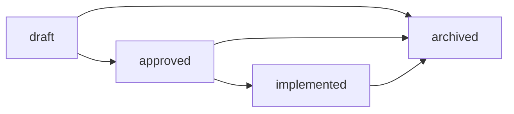

# Design Specs

This directory holds per-feature design documents. A spec describes what is being built, why, how, and what alternatives were considered, **before** implementation begins.

## When to write a design spec

Write a spec when you're about to **build or explore a feature**. Heuristics:

- "Here is how feature X works, here are the screens, here is the data flow" — yes, spec.
- "We will use library A over library B" — no, ADR (see [../adr/](../adr/)).
- "Fix this typo" / "rename this variable" — no, just do it.

Specs are **edited freely** in `draft` and `approved`; **frozen** on `implemented`; **archived** if abandoned or superseded.

## Lifecycle

- **draft** — exploring; may be abandoned. Folds in the "RFC" role: an unsure-if-we'll-ship spec lives here.
- **approved** — design locked, ready to build.
- **implemented** — shipped. The spec is now historical; do not edit (write a new spec or an ADR for revisions).
- **archived** — abandoned, superseded, or no longer relevant. Kept for context.

## Index

| Date                                                           | Title                                          | Status                                                     |
| -------------------------------------------------------------- | ---------------------------------------------- | ---------------------------------------------------------- |
| [2026-08-09](2026-08-09-entry-branding-refresh-and-roadmap.md) | Entry branding refresh + August review roadmap | partially implemented — Batch 5 deferred, Batch 6 unscoped |

### Archived

Superseded phase specs (the 2026-05/06 Uplevel, Restrained Flourish, Voice Logging, and SDK 56 scoping documents) were frozen after implementation and have been removed from the working tree — retrieve them from git history under `docs/specs/archive/` if needed. The behavior they described lives in the code and in [../adr/](../adr/). The same is true of a later batch, also frozen on implementation and removed from the working tree — retrieve them from git history if needed: 2026-05-26 Docs Uplevel: ADRs + Design Specs; 2026-06-10 Deep Review improvement plan (115 confirmed findings plus phased fix plan); 2026-07-11 Taste Audit (round 2); 2026-07-11 Blacktop Overhaul — Direction C spec; 2026-07-19 Set-entry redesign spec and its companion plan; 2026-08-09 PR semantics spec; 2026-08-09 Session capture spec (session times plus workout/exercise notes); 2026-08-09 Quick-log spec; and 2026-08-10 Plan-reaches-Today spec.

## Template

See [TEMPLATE.md](TEMPLATE.md). Copy it to `YYYY-MM-DD-<topic>-design.md` and fill in.
