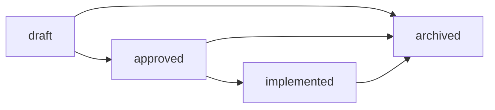

# Design Specs

This directory holds per-feature design documents. A spec describes what is being built, why, how, and what alternatives were considered, **before** implementation begins.

## When to write a design spec

Write a spec when you're about to **build or explore a feature**. Heuristics:

- "Here is how feature X works, here are the screens, here is the data flow" — yes, spec.
- "We will use library A over library B" — no, ADR (see [../adr/](../adr/)).
- "Fix this typo" / "rename this variable" — no, just do it.

Specs are **edited freely** in `draft` and `approved`; **frozen** on `implemented`; **archived** if abandoned or superseded.

## Lifecycle

- **draft** — exploring; may be abandoned. Folds in the "RFC" role: an unsure-if-we'll-ship spec lives here.
- **approved** — design locked, ready to build.
- **implemented** — shipped. The spec is now historical; do not edit (write a new spec or an ADR for revisions).
- **archived** — abandoned, superseded, or no longer relevant. Kept for context.

## Index

| Date | Title | Status |
| --- | --- | --- |
| [2026-05-26](2026-05-26-docs-uplevel-design.md) | Docs uplevel: ADRs + design specs | approved |

## Template

See [TEMPLATE.md](TEMPLATE.md). Copy it to `YYYY-MM-DD-<topic>-design.md` and fill in.
