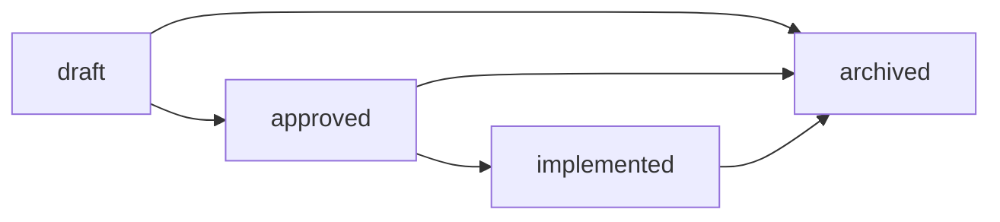

# Design Specs

This directory holds per-feature design documents. A spec describes what is being built, why, how, and what alternatives were considered, **before** implementation begins.

## When to write a design spec

Write a spec when you're about to **build or explore a feature**. Heuristics:

- "Here is how feature X works, here are the screens, here is the data flow" — yes, spec.
- "We will use library A over library B" — no, ADR (see [../adr/](../adr/)).
- "Fix this typo" / "rename this variable" — no, just do it.

Specs are **edited freely** in `draft` and `approved`; **frozen** on `implemented`; **archived** if abandoned or superseded.

## Lifecycle

- **draft** — exploring; may be abandoned. Folds in the "RFC" role: an unsure-if-we'll-ship spec lives here.
- **approved** — design locked, ready to build.
- **implemented** — shipped. The spec is now historical; do not edit (write a new spec or an ADR for revisions).
- **archived** — abandoned, superseded, or no longer relevant. Kept for context.

## Index

| Date                                            | Title                             | Status      |
| ----------------------------------------------- | --------------------------------- | ----------- |
| [2026-05-26](2026-05-26-docs-uplevel-design.md) | Docs Uplevel: ADRs + Design Specs | implemented |

### Archived

Implemented phase specs, frozen and kept for historical context under [archive/](archive/). The behavior they describe now lives in the code and in [../adr/](../adr/); revise via a new spec or ADR, not by editing these.

| Date                                                                  | Title                                       | Status      |
| --------------------------------------------------------------------- | ------------------------------------------- | ----------- |
| [2026-05-26](archive/2026-05-26-uplevel-phase-1-signature-design.md)  | Uplevel Phase 1 — Signature                 | implemented |
| [2026-05-27](archive/2026-05-27-uplevel-phase-2-trust-design.md)      | Uplevel Phase 2 — Trust                     | implemented |
| [2026-05-27](archive/2026-05-27-uplevel-phase-3-restraint-design.md)  | Uplevel Phase 3 — Restraint                 | implemented |
| [2026-05-28](archive/2026-05-28-uplevel-phase-4-dimensions-design.md) | Uplevel Phase 4 — Dimensions                | implemented |
| [2026-05-31](archive/2026-05-31-restrained-flourish-design.md)        | Restrained Flourish — design                | implemented |
| [2026-05-31](archive/2026-05-31-restrained-flourish.md)               | Restrained Flourish — implementation plan   | implemented |
| [2026-05-31](archive/2026-05-31-voice-workout-logging-design.md)      | Voice Workout Logging — design              | implemented |
| [2026-05-31](archive/2026-05-31-voice-workout-logging.md)             | Voice Workout Logging — implementation plan | implemented |
| [2026-06-01](archive/2026-06-01-expo-sdk-56-migration-scoping.md)     | Expo SDK 56 Migration — scoping             | implemented |

## Template

See [TEMPLATE.md](TEMPLATE.md). Copy it to `YYYY-MM-DD-<topic>-design.md` and fill in.
